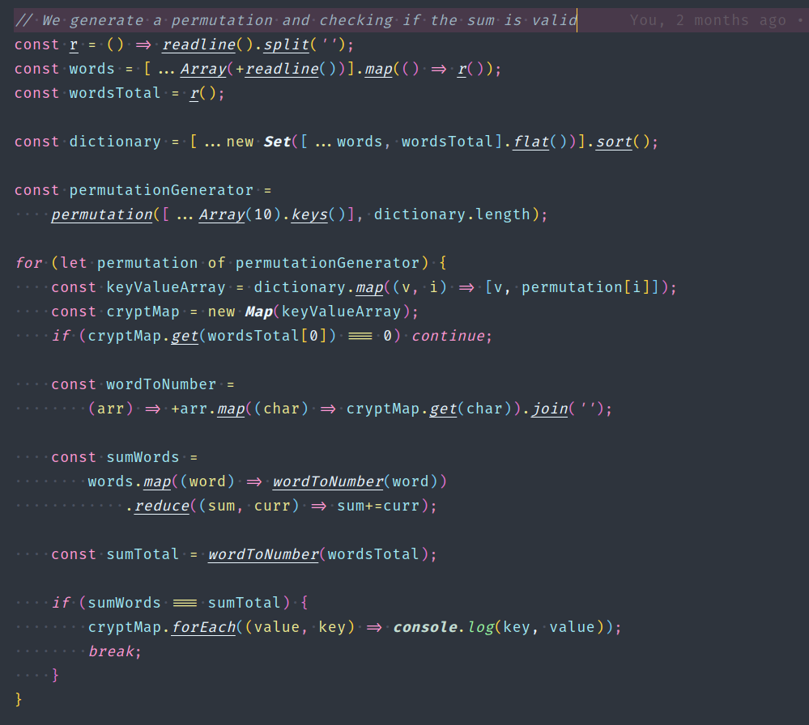
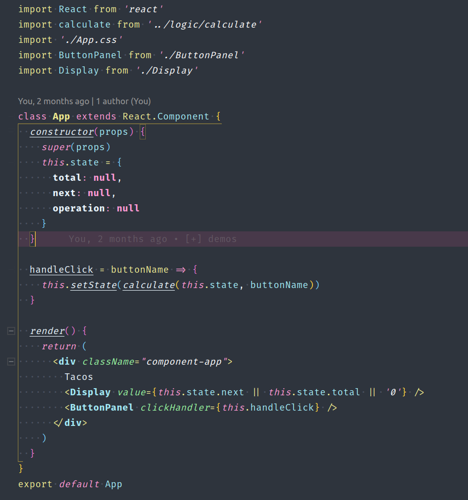

# 

[](https://marketplace.visualstudio.com/items?itemName=DennisVash.summer-time) [](https://marketplace.visualstudio.com/items?itemName=DennisVash.summer-time) [](https://marketplace.visualstudio.com/items?itemName=DennisVash.summer-time) [](https://marketplace.visualstudio.com/items?itemName=DennisVash.summer-time)

> Summer-Time is a modern Dark Material theme for VS-Code IDE.

The **minimalistic design** makes the developer to **concentrate** on what's important while **understanding** the code flow.

## Color Palette

<div align="center">
    <a>
        
    </a>
</div>

## Usage

-  `#F699D9` Keywords
-  `#AEE9F5` Variables
-  `#EBEA8B` Operators
-  `#A8F79A` Static
-  `#ECF6FF` Functions
-  `#2B303B` Background

## Screenshots

<div align="center">

<br>



<br>

<br>




<br>

<br>


</div>

## Configuration

Recommended [VSCode Settings](https://code.visualstudio.com/docs/getstarted/settings):

```json
{
    // Work Bench
    "workbench.colorTheme": "Summer Time",
    "workbench.iconTheme": "material-icon-theme",
    "workbench.statusBar.feedback.visible": false,
    "workbench.statusBar.visible": true,
    "workbench.startupEditor": "newUntitledFile",
    "workbench.editor.enablePreview": false,
    "workbench.editor.highlightModifiedTabs": true,

    // Explorer
    "explorer.confirmDelete": false,
    "explorer.decorations.badges": false,
    "explorer.sortOrder": "type",
    "explorer.confirmDragAndDrop": false,

    // Terminal
    "terminal.integrated.cursorStyle": "underline",
    "terminal.integrated.cursorBlinking": true,
    "terminal.integrated.fontSize": 12,
    "terminal.integrated.fontWeight": "100",
    "terminal.integrated.fontFamily": "Hack Nerd Font Mono",

    // Editor
    "editor.mouseWheelZoom": true,
    "editor.snippetSuggestions": "top",
    "editor.autoClosingBrackets": "always",
    "editor.rulers": [
        100
    ],
    "editor.renderIndentGuides": false,
    "editor.fontLigatures": true,
    "editor.renderControlCharacters": false,
    "editor.autoClosingQuotes": "always",
    "editor.formatOnSave": false,
    "editor.formatOnType": true,
    "editor.fontSize": 15,
    "editor.lineHeight": 24.65,
    "editor.letterSpacing": 0.5,
    "editor.fontWeight": "400",
    "editor.cursorStyle": "line-thin",
    "editor.cursorWidth": 5,
    "editor.cursorBlinking": "solid",
    "editor.renderWhitespace": "all",
    "editor.glyphMargin": true,
    "editor.suggest.snippetsPreventQuickSuggestions": false,

    // Icons
    "material-icon-theme.activeIconPack": "react_redux",
    "material-icon-theme.folders.theme": "specific",
    "material-icon-theme.hidesExplorerArrows": true,
}
```

### Extensions

- [Nerd-Fonts](https://github.com/ryanoasis/nerd-fonts)
- [Material Icon Theme](https://marketplace.visualstudio.com/items?itemName=DennisVash.summer-time)
- [Bracket Pair Colorizer](https://marketplace.visualstudio.com/items?itemName=CoenraadS.bracket-pair-colorizer)

## Other Places

- [🍦 JetBrains Theme](https://github.com/denvash/summer-time-theme-jetbrains)